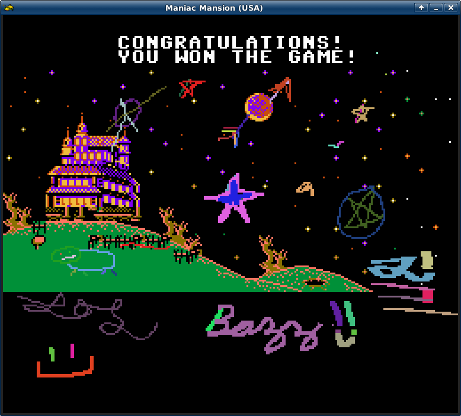

Graffiti Netplay Enhancement
============================

Graffiti allows you to draw on the surface of your game. It can be used locally
or during netplay. It is intended to be a fun addition to the netplay experience.




Trying it out
=============

First you'll need a binary of this software. That likely means you'll have to build it yourself. See the **Building** section below.

Once you've opened a ROM up (eg. `mednafen mario.smc`), you can immediately begin testing the graffiti feature! Now, it's most fun with a friend online, but you can run it locally too.

### Testing locally

First, press 't' to get a console prompt, then type `/g on` to enable graffiti mode. Now, when your mouse is over the game screen, you see a black square. You can now do the following:

- Left-Click and Drag: Draw
- Mouse Wheel: Change brush size
- Right-Click and Drag: Erase

### Playing Online

Make sure that both you and your buddy have Graffiti, and an identical copy of the game you're gonna play. Once you open the rom up, press 't' to get a console prompt, then type `/connect` to connect to mednafen's server. Once connected, the graffiti feature will automatically become activated. Once your friend joins the game, you can use 't' to chat with each other, and also have fun playing with graffiti together!

#### Good News

The 64-bit Windows build and the linux one netplay each other well!


Building
========

When building directly from git, run the following commands from the project directory:

```
aclocal -I .; autoconf; automake --add-missing -c
./configure
make
sudo make install
```

### Cross Building For Windows (Gentoo)

Here is how I built this thing from Gentoo's crossdev. Assuming you have it with mingw64

```
emerge -av sys-devel/crossdev
crossdev --target x86_64-w64-mingw32
# install deps
x86_64-w64-mingw32-emerge media-libs/libsdl media-libs/libsndfile
```

First download zlib. I used 1.2.11. Compile as follows
- Patch win32/Makefile.gcc
```
@@ -41,9 +41,9 @@
 #LOC = -DASMV
 #LOC = -DZLIB_DEBUG -g

-PREFIX =
+PREFIX = x86_64-w64-mingw32-
 CC = $(PREFIX)gcc
-CFLAGS = $(LOC) -O3 -Wall
+CFLAGS = $(LOC) -O3 -Wall -D_LFS64_LARGEFILE=1 -D_LARGEFILE64_SOURCE=1

 AS = $(CC)
 ASFLAGS = $(LOC) -Wall
```

- Patch `zlib.conf` as mentioned in mednafen's [README.MSWIN](./README.MSWIN)
- Run in zlib directory `make -f win32/Makefile.gcc`

- Maybe not necessary, but I used `sed` to patch all mednafen source containing <zlib.h> to "zlib.h" to override system-installed zlib.

```
ag zlib.h | cut -f1 -d':' | xargs -n1 -I{} sed -i.bak 's/<zlib.h>/"zlib.h"/' {}
```

I used the silver searcher but you could use `grep -r` and adjust the parsing

- configure mednafen with `CPPFLAGS="-D_LFS64_LARGEFILE=1 -I$PWD/zlib/zlib-1.2.11" LDFLAGS="-L$PWD/zlib/zlib-1.2.11" ./configure --host=x86_64-w64-mingw32 --with-sdl-prefix=/usr/x86_64-w64-mingw32/usr --with-sysroot=/usr/x86_64-w64-mingw32/usr/ && make`

- Uncomment the line in `include/config.h` containing `#undef HAVE_SIGACTION`

- `make`

- `cd src/.libs`

- Copy all necessary DLLs

```
cp /usr/x86_64-w64-mingw32/usr/bin/{libsndfile-1.dll,libiconv-2.dll} .
cp ../../zlib/zlib-1.2.11/zlib1.dll .
cp /usr/lib/gcc/x86_64-w64-mingw32/9.2.0/{libgcc_s_seh-1.dll,libstdc++-6.dll} .
```

- Now try running a rom `wine ./mednafen.exe ditritus.pce`

About The Implementation
========================

When I aspired to create the graffiti feature, I knew for it to be successful, it had to simply work with the pre-existing netplay servers. This meant opting for an implementation that takes place completely over the client. By having it done this way, there was no need to require a custom server. It *just worked*.
